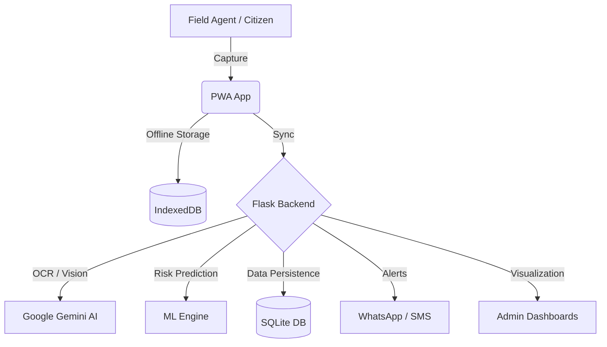

# 🌊 JalScan: AI-Powered River Monitoring & Flood Prediction System
<div align="center">
    
[](https://flask.palletsprojects.com/)
[](https://ai.google.dev/)
[](https://web.dev/progressive-web-apps/)
[](LICENSE)

> **"JalScan doesn't just show you the water level; it shows you the river's health, its behavior, and its future."**

JalScan is a next-generation water monitoring solution designed for the **Smart India Hackathon 2025**. It leverages cutting-edge AI, machine learning, and offline-first mobile technology to provide real-time flood risk assessment, secure data collection, and predictive analytics for field agents and decision-makers.
</div>
---------

## Key Innovations

### 🧠 River Memory AI Digital Twin
JalScan implements a unique **River Memory AI** system that creates a digital twin for every monitoring site. It doesn't just record numbers; it analyzes:
*   **Water Color**: Turbidity and pollution detection using HSV classification.
*   **Flow Estimation**: Optical flow velocity analysis for rapid rise detection.
*   **Gauge Health**: Automated detection of algae, fading, or damage to measurement scales.
*   **Erosion Tracking**: SSIM-based vision analysis to monitor riverbank changes.

### 🔮 Predictive Intelligence
Powered by a **RandomForest Classifier** (engineered with 24 site-specific features), JalScan predicts flood risks 6 hours ahead, categorizing them into:
1.  ✅ **SAFE**: Normal operations.
2.  ⚠️ **CAUTION**: Water levels rising; monitor closely.
3.  🚨 **FLOOD RISK**: Imminent overflow; prepare response.
4.  🌊 **FLASH FLOOD**: Extreme risk; immediate evacuation required.

### 🛡️ Trust & Security (Zero-Tamper)
To ensure data integrity from remote sites, JalScan uses a multi-layered verification stack:
*   **GPS Geofencing**: Enforces submissions within a ±50m radius of the site.
*   **QR Code Authentication**: Physical site verification via unique QR codes.
*   **AI Tamper Detection**: Analyzes submissions for image manipulation, timestamp anomalies, and location spoofing.
*   **ID-Verified Citizen Reporting**: Public contributions require Government ID (Aadhaar/PAN) verification with live selfies.

-----------------------------------------------------------------------------------------------------------------------------------

## 🛠️ Technology Stack

### Backend & Core
*   **Language**: Python 3.13
*   **Framework**: Flask 3.0+
*   **ORM**: SQLAlchemy with **SQLite** (Scalable to PostgreSQL)
*   **Authentication**: Flask-Login with custom Role-Based Access Control (RBAC)

### AI & Machine Learning
*   **Vision AI**: Google Gemini 1.5/2.0 Flash (OCR & Scene Validation)
*   **Core ML**: scikit-learn (RandomForest), NumPy, Pandas
*   **Image Processing**: OpenCV (Feature extraction & Tamper detection)
*   **NLP**: Gemini-powered **JalHelp** Crisis Assistant

### Frontend & PWA
*   **UI Framework**: Bootstrap 5 with premium "Glassmorphism" aesthetics
*   **Mapping**: Leaflet.js for interactive site & weather overlays
*   **Charts**: Chart.js for real-time analytics
*   **Offline Engine**: Service Workers + IndexedDB for reliable field operation without internet

### Communication
*   **WhatsApp**: Twilio WhatsApp API for real-time alerts and queries
*   **Voice**: Twilio Voice API for AI-powered speech-to-report submissions

---

## 📁 System Architecture



---

## 👩‍💻 User Roles

| Role | Access Level | Responsibilities |
|      |              |                  |
| **Admin** | Superuser | System config, user management, global security audit |
| **Supervisor** | Multi-Site | Team oversight, manual alert triggering, river management |
| **Central Analyst** | Data-Only | Trend analysis, tamper detection review, report generation |
| **Field Agent** | Site-Only | Data capture, QR verification, offline submissions |

---

## 🏁 Getting Started

### Prerequisites
*   Python 3.10+
*   Google Gemini API Key
*   Twilio Credentials (for WhatsApp/Voice)

### Installation
1.  **Clone the Repo**:
    ```bash
    git clone https://github.com/vishnu601/jalscan-sih.git
    cd jalscan-sih
    ```
2.  **Environment Setup**:
    ```bash
    python -m venv venv
    source venv/bin/activate  # Or venv\Scripts\activate on Windows
    pip install -r requirements.txt
    ```
3.  **Configuration**:
    Create a `.env` file from `.env.example`:
    ```env
    FLASK_APP=app.py
    SECRET_KEY=your_secret_key
    GOOGLE_API_KEY=your_gemini_key
    ```
4.  **Database & Run**:
    ```bash
    python init_db.py
    python app.py
    ```

---

## 📊 Monitoring Sites
JalScan currently monitors critical stations across major Indian rivers:
*   **Ganga**: Haridwar (UK)
*   **Musi**: Hyderabad (TS)
*   **Krishna**: Kanchipuram (TN)
*   **Yamuna**: Delhi (DL)
*   **Godavari**: Nashik (MH)

---

## 👨‍💻 Project History
Developed as a premium solution for **Smart India Hackathon 2025**, JalScan represents a leap forward in community-driven, AI-integrated flood management systems.

---
*Version 4.0 | Fully Updated February 2026*
